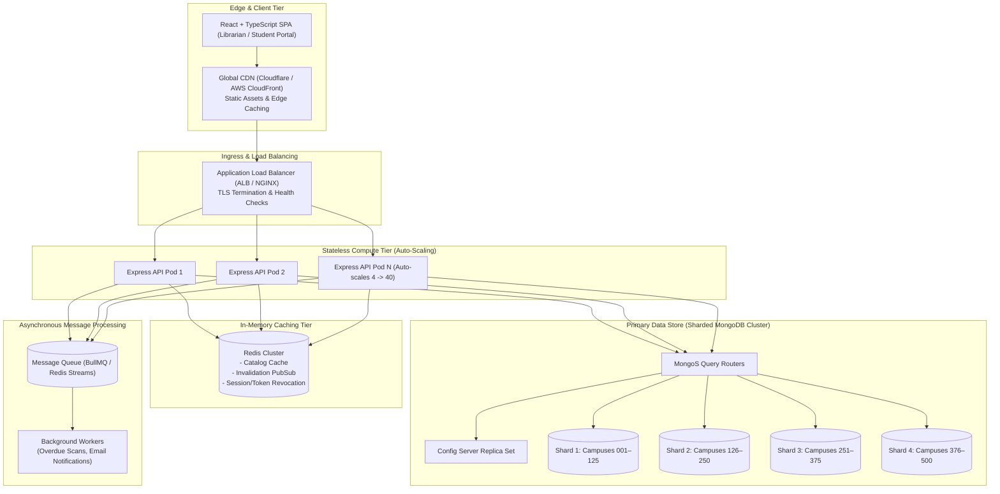

# ShelfLife — Section C: System Design & Scalability Architecture

## IA2 Examination — Question 3 (10 Marks)

This document presents the complete system design and architecture for scaling **ShelfLife** across **500 campus libraries**, **2 million registered members**, and handling **10× peak traffic spikes** during semester-start weeks.

---

## Q3 (a) High-Level Architecture Diagram & Description [2 Marks]

### Architecture Diagram (Mermaid)



### Component Breakdown & Responsibilities

1. **Client & Global CDN (Edge Tier):**
   - Serves pre-compiled Vite React + TypeScript single-page application static bundles (HTML/JS/CSS/images) directly from edge nodes (Cloudflare/AWS CloudFront).
   - Offloads 100% of static asset traffic from backend servers.
2. **Application Load Balancer (ALB / NGINX Ingress):**
   - Terminates TLS/SSL connections, enforces rate limiting, performs `/health` endpoint checks, and routes HTTPS API traffic across backend Express instances using least-connections algorithms.
3. **Stateless Express API Cluster (Compute Tier):**
   - Stateless Node.js/Express containers deployed on Kubernetes (EKS/GKE) or Cloud Run.
   - Handles JWT authentication, request validation, business logic, and API response formatting.
   - Fully stateless architecture enables instantaneous horizontal auto-scaling (HPA).
4. **Redis In-Memory Cache (Caching Tier):**
   - Caches frequent read queries (book catalog browsing, genre filters).
   - Serves as a high-throughput broker for background message queues and pub/sub cache invalidation.
5. **Sharded MongoDB Cluster (Primary Data Store):**
   - Multi-shard MongoDB cluster managed via `mongos` query routers and dedicated config servers.
   - Partitions data cleanly across shards by campus tenant (`libraryId`).
6. **Message Queue & Background Workers (Async Tier):**
   - Dequeues asynchronous tasks (nightly overdue status reconciliations, reminder emails, audit logging) via BullMQ without blocking synchronous user HTTP calls.

---

## Q3 (b) MongoDB Sharding Strategy & Shard Key Justification [2 Marks]

### Cluster Decision: Single Cluster vs. Sharded Cluster
We **shard the MongoDB cluster**.

**Justification:**
With **500 campus libraries**, **2 million members**, and millions of historical borrow records, a single MongoDB replica set would hit memory boundaries (WiredTiger working set cache exhaustion) and IOPS limits during the 10× semester-start surge. Sharding provides horizontal scale out for both storage capacity and write/read IOPS.

### Proposed Shard Keys & Justification

| Collection | Proposed Shard Key | Justification & Query Routing |
| :--- | :--- | :--- |
| **`Book`** | `{ libraryId: 1, ISBN: 1 }` | **Tenant Isolation + High Cardinality:** 99% of queries are scoped to a specific campus library (`libraryId`). Leading with `libraryId` ensures queries route directly to a single shard (preventing expensive scatter-gather queries across all shards). Adding `ISBN` provides high cardinality to prevent jumbo chunks for large campus collections. |
| **`BorrowRecord`** | `{ libraryId: 1, member: 1, issueDate: -1 }` | **Co-located History & Fast Reads:** Borrow records and member history queries (`/api/members/:id/history`) are scoped to a campus and member. Co-locating all records for a member on the same shard avoids cross-shard joins, and the compound index supports sorting by `issueDate` without in-memory sort penalties. |

---

## Q3 (c) Caching Strategy for Read-Heavy Operation [2 Marks]

### 1. Single Most Read-Heavy Operation
**Catalog Search and Genre Filtering (`GET /api/books?genre=...&page=...&limit=...`)**
During semester week, catalog searches represent **> 85% of total system traffic** as 2 million students search for required textbooks across 500 libraries.

### 2. Caching Strategy (Redis Cache-Aside)

- **What is Cached:** The serialized JSON string response payload of the catalog list endpoint.
- **Cache Key Format:**
  ```text
  books:{libraryId}:{genre}:{page}:{limit}
  ```
  *Example:* `books:campus_102:Computer Science:1:10`

- **Time-To-Live (TTL):**
  **120 seconds (2 minutes)**. A 2-minute TTL guarantees high cache hit ratios (> 90%) during peak rush hours while ensuring data staleness remains strictly bounded.

- **Cache Invalidation Triggers:**
  Real-time event-driven cache invalidation via Redis Pub/Sub:
  1. **Book Issued (`POST /api/borrow`):** Automatically evict all catalog cache keys matching `books:{libraryId}:{genre}:*` for the affected book's campus and genre.
  2. **Book Returned (`POST /api/return/:borrowId`):** Automatically evict relevant catalog cache keys.
  3. **New Book Added (`POST /api/books`):** Evict first-page and genre catalog keys for that library.

---

## Q3 (d) Race Condition Prevention in "Issue Book" Operation [2 Marks]

### Mechanism Selected: Atomic Conditional Database Execution (`findOneAndUpdate`)

To guarantee `availableCopies` never drops below 0 under concurrent issuance requests for the last remaining copy (`availableCopies: 1`), we use an **atomic conditional update** at the database engine level:

```javascript
// Atomically decrement availableCopies ONLY if availableCopies > 0
const updatedBook = await Book.findOneAndUpdate(
  {
    _id: bookId,
    availableCopies: { $gt: 0 }
  },
  {
    $inc: { availableCopies: -1 }
  },
  {
    new: true,
    session // Optional Mongoose session for multi-document ACID transaction
  }
);

if (!updatedBook) {
  // Second concurrent request finds 0 available copies and fails atomically
  return res.status(400).json({
    success: false,
    message: "Book is currently unavailable for borrowing"
  });
}
```

### Why Atomic DB Operations were Chosen Over Alternatives

1. **Over Distributed Locks (e.g., Redlock / Redis Lock):**
   - Distributed locks introduce additional network round-trips to Redis, lock timeout management, deadlock risks, and failure modes during network partitions. Atomic DB updates leverage MongoDB's native document-level write locks with zero external latency overhead.
2. **Over Message Queues (FIFO Queue Serial Processing):**
   - Queuing issue requests turns a fast synchronous HTTP API into an asynchronous task queue requiring client polling or WebSockets. This increases system complexity and latency for a standard check-out operation.
3. **Over Optimistic Locking (Version Numbers `@version` / retry loops):**
   - Optimistic locking requires application-level retry logic under high contention. When hundreds of students attempt to borrow the last 5 copies of a textbook simultaneously, optimistic locking triggers severe retry storms, causing CPU spikes and database write degradation.

---

## Q3 (e) Handling 10× Semester-Start Traffic Spikes [2 Marks]

To absorb a **10× surge** in traffic (e.g., jumping from 1,000 req/sec to 10,000 req/sec) without paying for idle, over-provisioned infrastructure year-round, we implement an **elastic, cloud-native auto-scaling strategy**:

1. **Horizontal Pod Autoscaling (HPA) for Express API:**
   - Stateless Node.js API containers run on Kubernetes with HPA configured to monitor CPU utilization (> 65%) and request latencies (> 200ms).
   - Baseline cluster size: **4 pods**.
   - Peak semester week cluster size: Auto-scales dynamically up to **40 pods**.
   - After peak week passes, HPA automatically scales down to 4 pods, minimizing operational costs.
2. **Edge Asset & Read Offloading (CDN + Redis Cache):**
   - **CDN:** Cloudflare/CloudFront caches static frontend assets and public catalog pages, handling 100% of static bandwidth at zero backend compute cost.
   - **Redis:** Serves > 90% of book search requests directly from in-memory RAM (< 3ms response time), preventing MongoDB from being overloaded by search traffic.
3. **MongoDB Connection Pooling & Replica Read Offloading:**
   - Backend API connection pools use `minPoolSize: 10` and `maxPoolSize: 50` per pod.
   - Non-critical read queries use MongoDB read preference `secondaryPreferred`, offloading read traffic to secondary replica nodes while primary nodes handle atomic write operations.
4. **Asynchronous Batch Processing:**
   - Non-urgent background operations (nightly overdue status audits, reminder email notifications) are queued in BullMQ and processed off-peak (between 2:00 AM – 5:00 AM) by background worker nodes.
