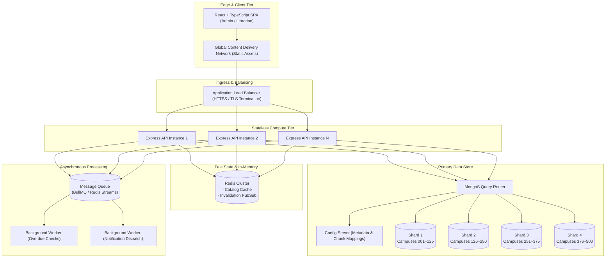
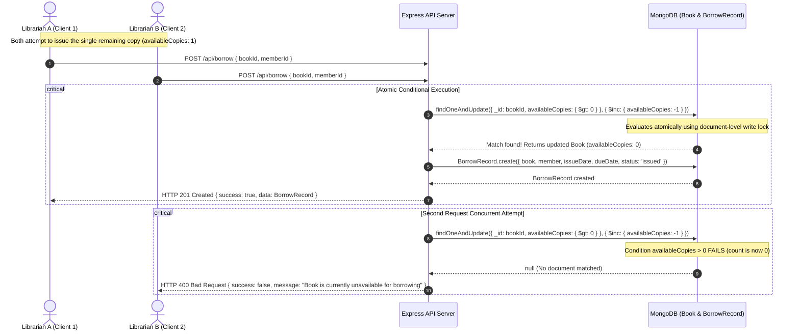
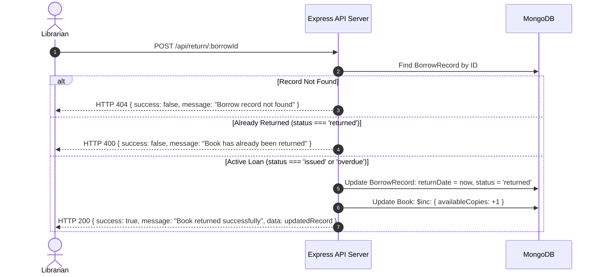

# ShelfLife — Architecture Diagram & Data Flow

This document provides visual diagrams detailing the ShelfLife Library Management System architecture, component relationships, and key transactional flows.

## 1. High-Level Multi-Tier Architecture

---

## 2. Issue Book Atomic Transaction & Concurrency Flow

The sequence below illustrates how race conditions are eliminated when issuing the last available copy of a book under concurrent requests:

---

## 3. Return Book Workflow

