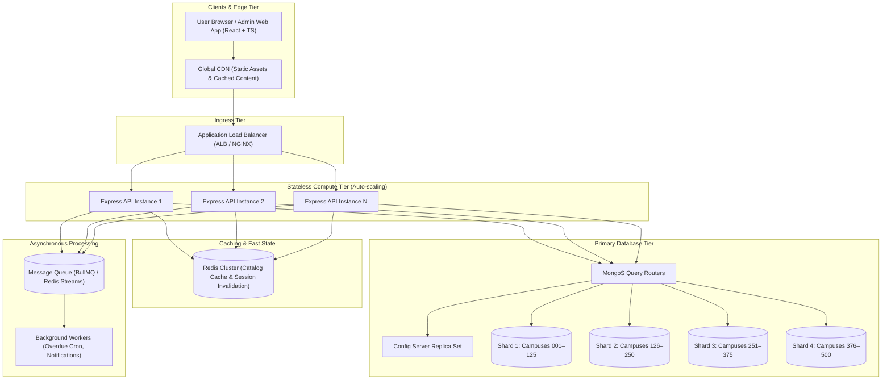

# ShelfLife — System Design & Scalability Architecture

## 1. Executive Summary & Design Scope

**ShelfLife** is a multi-campus Library Management System engineered to scale across **500 campus libraries**, serving approximately **2,000,000 registered members**, handling steady-state library operations and seamlessly absorbing **10× traffic spikes** during the first week of each academic semester.

### Key Workload Characteristics
- **Scale:** 500 campus libraries, 2,000,000 members.
- **Inventory:** ~5,000,000 book copies distributed across campuses.
- **Traffic Profile:** Highly read-heavy during normal operations (85% book searches/catalog browsing, 15% issue/return/history operations).
- **Peak Traffic:** First week of semester experiences a **10× surge** in catalog browsing, reserve requests, and check-outs.
- **Critical Invariant:** Strong inventory consistency — a book's `availableCopies` must **never drop below 0**, preventing double-allocation even during peak concurrent loan requests.

---

## 2. High-Level Architecture

The system adopts a horizontally scalable, decoupled architecture separating stateless API processing, read-optimized caching, partitioned primary storage, and asynchronous background processing.



### Component Roles & Responsibilities

1. **Global CDN (Cloudflare / CloudFront):**
   - Serves pre-built Vite React application bundles, stylesheets, and static media at the edge.
   - Offloads 100% of static asset traffic from backend application servers.
2. **Application Load Balancer (ALB / NGINX):**
   - Distributes incoming HTTPS requests across active Node.js/Express API instances using a least-connections or round-robin algorithm.
   - Performs SSL termination, health checking (`/health`), and rate limiting.
3. **Stateless Express API Layer:**
   - Handles authentication, request validation, business logic, and API formatting.
   - Stateless design permits instantaneous horizontal autoscaling based on CPU/RAM thresholds or request volume.
4. **Redis In-Memory Cache:**
   - Caches frequent catalog queries (`GET /api/books?genre=...&page=...`).
   - Serves as the high-throughput broker for background task queues.
5. **Sharded MongoDB Cluster:**
   - Distributed document store providing high write and read throughput, partitioned cleanly by campus tenant (`libraryId`).
6. **Message Queue & Background Workers:**
   - Dequeues asynchronous tasks such as nightly overdue status sweeps, email notices, and audit logging without blocking user-facing HTTP request-response cycles.

---

## 3. MongoDB Scaling & Sharding Strategy

### Cluster Architecture: Single Cluster vs. Sharded Cluster
While a single replica set can comfortably handle small-to-medium datasets, managing **500 libraries** with **2 million members** and millions of borrow records across multi-year histories exceeds the optimal write throughput and memory cache (WiredTiger cache) of a single node. 

Therefore, MongoDB is deployed as a **horizontal Sharded Cluster** using `mongos` query routers and shard replica sets.

### Tenant-Aware Partitioning via `libraryId`
Each campus library operates independently; 99% of queries (browsing a library's books, issuing a book to a student registered at that campus, viewing a campus member's history) are scoped to a specific campus. Thus, introducing `libraryId` as the leading shard key prefix establishes natural **tenant isolation** and avoids expensive scatter-gather queries across shards.

### Shard Keys Selection & Justification

| Collection | Proposed Shard Key | Justification & Query Routing |
| :--- | :--- | :--- |
| **`Book`** | `{ libraryId: 1, ISBN: 1 }` | **Targeted Queries:** Routing queries with `libraryId` targets a single shard. Including `ISBN` prevents jumbo chunks for large campus collections and ensures uniform key cardinality across the cluster. |
| **`Member`** | `{ libraryId: 1, membershipId: 1 }` | **Single-Shard Routing:** Member lookup and registration are campus-scoped. High cardinality of `membershipId` guarantees even chunk distribution. |
| **`BorrowRecord`** | `{ libraryId: 1, member: 1, issueDate: -1 }` | **Optimized History & Local Writes:** Borrow records and member history queries (`/api/members/:id/history`) are routed to a single shard. Sorting by `issueDate: -1` leverages the compound index directly without in-memory sorting. |

### Indexing Strategy
- **Book:** `db.books.createIndex({ libraryId: 1, genre: 1, availableCopies: 1 })`
- **Book (Search):** `db.books.createIndex({ libraryId: 1, title: "text" })`
- **BorrowRecord (Active Loans):** `db.borrowrecords.createIndex({ libraryId: 1, status: 1, dueDate: 1 })`
- **Member:** `db.members.createIndex({ email: 1 }, { unique: true })`

---

## 4. Caching Architecture (Redis)

### Read-Heavy Hotspot Analysis
The primary read bottleneck is catalog browsing and genre filtering (`GET /api/books?genre=Fiction&page=1&limit=10`), which constitutes over **80% of all semester-start requests**.

### Cache-Aside Strategy
- When a client queries `/api/books`, the API checks Redis first.
- **Cache Hit:** Returns JSON response in < 3ms.
- **Cache Miss:** Reads from MongoDB, responds to client, and populates Redis asynchronously with a short TTL.

### Cache Key Format
```text
books:{libraryId}:{genre}:{page}:{limit}
```
*Example:* `books:campus_042:Fiction:1:10` (or `books:all:Fiction:1:10` for global views).

### TTL (Time-To-Live)
A TTL of **120 seconds (2 minutes)** is applied. This bounds staleness while absorbing the bulk of repeated queries during rush hours.

### Invalidation Triggers
To prevent stale inventory displays:
1. **Book Issued (`POST /api/borrow`):** Invalidate all cache patterns for that book's campus and genre (`books:{libraryId}:{genre}:*`).
2. **Book Returned (`POST /api/return/:borrowId`):** Invalidate relevant catalog keys.
3. **New Book Added (`POST /api/books`):** Invalidate first-page keys and genre keys.

---

## 5. Concurrent Issue Operations & Race Condition Prevention

### The Concurrency Problem
When only 1 copy of a popular textbook remains (`availableCopies: 1`), two librarians or students might simultaneously submit an issue request. A traditional multi-step application workflow:
1. Query book (`availableCopies = 1`)
2. Verify `availableCopies > 0`
3. Decrement copy and write borrow record

...creates a critical **check-then-act race condition** where both requests evaluate `availableCopies > 0` simultaneously, decrementing the count to `-1` and loaning out non-existent inventory.

### Atomic Conditional Execution (Preferred Solution)
We enforce inventory invariants directly at the database engine using an **atomic conditional find-and-modify** operation:

```javascript
const updatedBook = await Book.findOneAndUpdate(
  {
    _id: bookId,
    availableCopies: { $gt: 0 }
  },
  {
    $inc: { availableCopies: -1 }
  },
  {
    new: true
  }
);

if (!updatedBook) {
  // If no document was matched and updated, another request claimed the last copy
  return res.status(400).json({
    success: false,
    message: "Book is currently unavailable for borrowing"
  });
}
```

### Consistency Guarantee: Transaction Support
In a sharded or replica-set environment, creating the `BorrowRecord` and decrementing `Book.availableCopies` can be wrapped in a **Mongoose session transaction** (`session.withTransaction(...)`). If BorrowRecord insertion fails (e.g., duplicate loan or validation failure), the decrement rolls back automatically.

### Why Conditional Updates Beat Alternative Approaches
- **vs. Distributed Locks (e.g., Redlock):** Distributed locks introduce network roundtrips, timeout failure modes, deadlocks, and complexity. Atomic updates leverage MongoDB's document-level concurrency without external coordination.
- **vs. Message Queues (Serial processing):** Queuing all issue requests introduces latency, stateful polling, and makes synchronous HTTP request handling difficult.
- **vs. Application-Level Locks (Node mutex):** Node mutexes only work within a single process and completely fail across multiple scaled instances.

---

## 6. Handling 10× Semester-Start Traffic Spikes

To absorb a 10× surge (e.g., from 1,000 req/sec to 10,000 req/sec) without incurring 10× full-time infrastructure costs:

1. **Horizontal Pod Autoscaling (HPA):**
   - The Express API layer scales from 4 baseline instances to 40 instances based on CPU utilization (> 65%) and request latency thresholds (> 200ms).
   - Once the first week passes, autoscaling scales instances down automatically.
2. **Read Offloading with Redis:**
   - In-memory caching satisfies up to 90% of catalog queries, protecting MongoDB from read saturation.
3. **Database Connection Pooling:**
   - Connection pools are configured with `minPoolSize: 10` and `maxPoolSize: 50` per instance to prevent exhausting database sockets during sudden scale-up.
4. **CDN Edge Caching:**
   - All frontend assets, scripts, and static media are distributed at CDN edge nodes, reducing web ingress traffic to zero application load.
5. **Background Workers for Heavy Batch Jobs:**
   - Daily overdue status updates and automated email notifications run off-peak via message queues (BullMQ) rather than during daytime traffic hours.

---

## 7. Assumptions & Business Rules

1. **Borrowing Window:** Default borrowing duration is 14 calendar days from the time of issuance.
2. **Role Boundaries:** Protected write operations (adding books, registering members, issuing books, returning books) are restricted to authenticated librarians via JWT.
3. **Overdue Status:** A loan record is strictly overdue if and only if `returnDate === null` and `dueDate < currentTimestamp`. Returned records preserve historical integrity and are marked as `returned`.
4. **Idempotent Return:** A returned borrow record cannot be returned again, preventing double-increment of available inventory.
